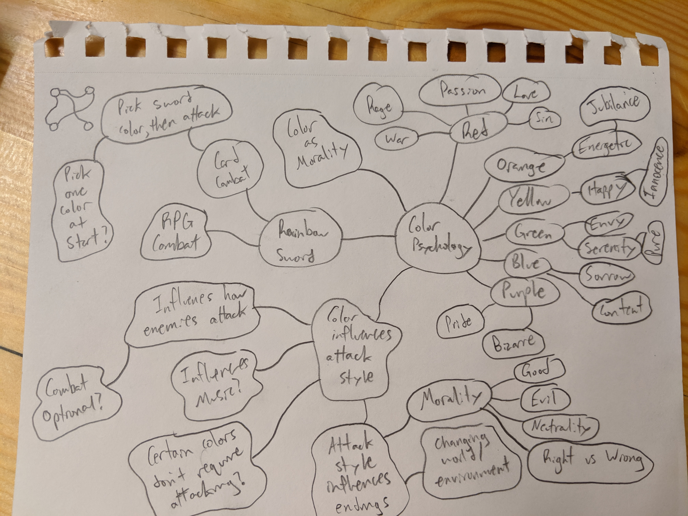
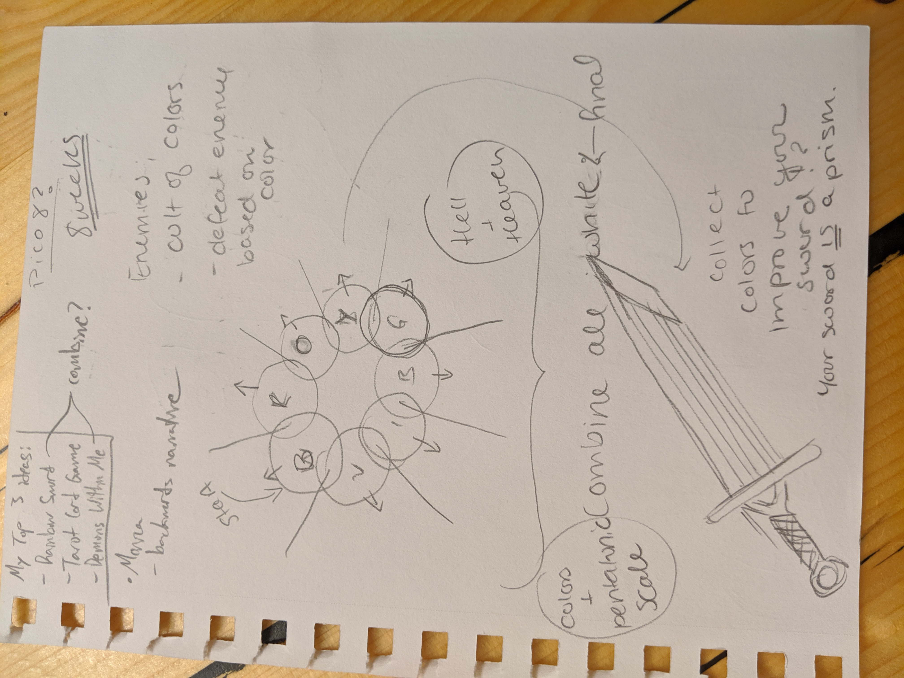
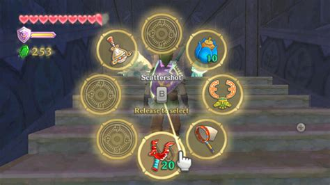
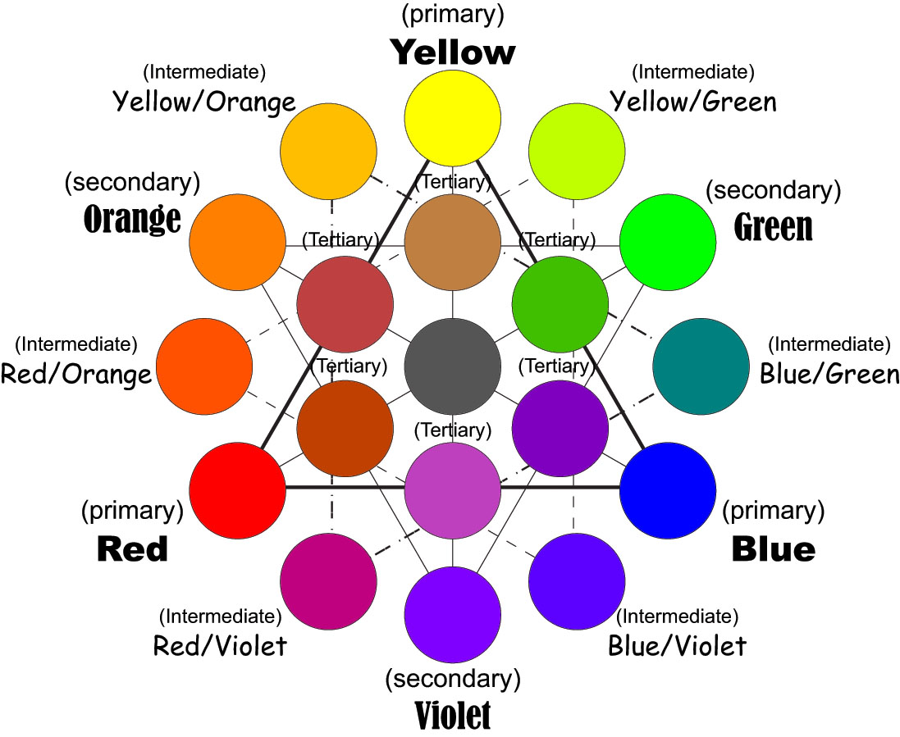

# Rainbow Sword

## INITIAL BRAINSTORMING

#### Rainbow Sword
- Each color has different properties : 
	- Red: (love/passion) / (hate/anger)	
		- DND: STRENGTH
		- PURE POWER
		- Weightier Attack
		- Positive:  increases/decreases power multiplier
		- Negative: decreases/increases power multiplier
		- NOTE : Subject to change as we figure out which way makes the most sense for this game
	- Orange: energy / sloth
		- DND: DEXTERITY
		- Positive : Increase power, speed, etc.
		- Negative : Decrease power, speed, etc.
	- Yellow:
		- DND: Charisma
		- LIGHTNING/SPARK
		- OVERWHELMING
		- Positive: Ecstasy (stable)
		- Negative: Anxious (unstable)
	- Green:
 		- DND: Constitution
		- Positive: Give health/heal
		- Negative: Take health/poison
	- Blue: sorrow / loyalty
		- DND: Intelligence - learned from books
		- Strong presence
		- Guardian, Obi-Wan
		- Scholarly Magic, Merlin, Hermione Granger, Obi-Wan
		- Disciplined
		- MANA (do do dododo)
		- Positive: “forked” spread laser attack
		- Negative: hyper-concentrated, slim laser attack
	- Purple: pride / generosity
		- DND: Wisdom - learned from life
		- Mace Windu, Allanon (Shannara Chronicles)
		- (Dark purple) Mystery + (Light purple) Spirituality?
		- MAGIC, all magic comes with a price
		- Wild Magic, Witch in a Forest, Maleficent?, Allanon
		- Positive:  Shields, protects
		- Negative: Huge area of effect, you get damaged as a side-effect
	- White: [End] Presence of ALL colors, “final weapon”
		- Master Sword Light Beam effect(?),  can’t do physical damage
		- Positive : ALL THE POWERS 
		- Negative : “White as a ghost”, Bones, Death, End of journey
	- Black:  [Begin] Absence of color - player will start the game with a black sword
		- Regular Sword(?), can only do physical damage
		- Positive :  PROTECTED, Can’t lose your base black sword
		- Negative : No powers
	- Rainbow Sword (no duality version):
		- Red: “evil,” viciousness, fury, power, risky
		- Orange: “good,” energy, speed, acceleration 
		- Yellow: “good,” joy, stuns, “swaying enemies” (making them not aggressive)
		- Green: “good,” serenity, healing, restoration
		- Blue: “evil,” sorrow, time, control
		- Purple: “evil,” pride, shielding, reflection of damage  **OR**, curses, hexes, “warlock” magic

#### Screens
##### Radial Subscreen
- Allows you to choose colors
- Choices are :
	- Just black 
	- Just white
		- All colors are activated for a limited amount of time
- Allow the player to choose one color for now 

If we have time to allow for color combos, players will be forced to choose 3 colors, where 1 of them is black/white and the other two are “whatever” combo they choose

#### Map Possibilities
- Tower battle(?) 
	- Start at the bottom to top
- Go wherever you like
		- Open world with scaling for enemies so player doesn’t become too weak or too strong in certain areas

